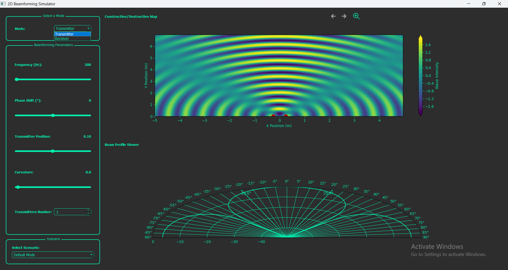
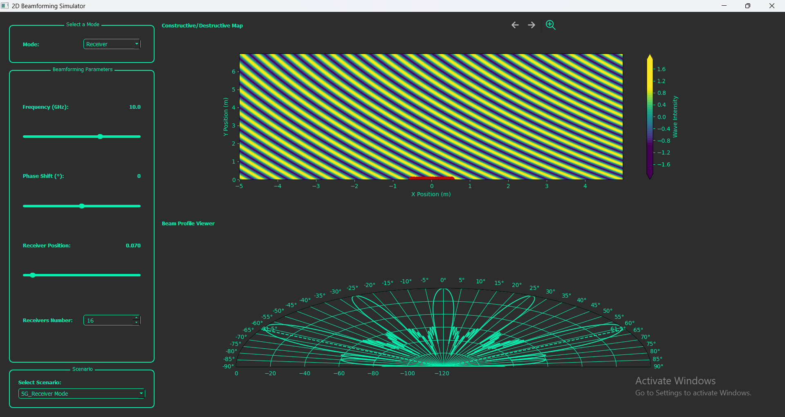

<h1 align="center">
    
</h1>

<h1 align="center"> 2D Beam-Forming Simulator</h1>
<h4 align="center"> 
	 Status: Finished
</h4>

<p align="center">
 <a href="#about">About</a> •
 <a href="#features">Features</a> •
 <a href="#how-it-works">How it works</a> • 
 <a href="#tech-stack">Tech Stack</a> •  
 <a href="#developers">Developers</a>
</p>

# About

**2D Beam-Forming simulator** This 2D Beamforming Simulator is a Python-based desktop application, built using PyQt, that demonstrates and visualizes the core principles of beamforming. The tool supports real-time parameter customization and provides synchronized viewers for understanding constructive and destructive interference and beam pattern analysis. Inspired by modern technologies like 5G, ultrasound imaging, and tumor ablation, this simulator allows users to experiment with various system configurations and phased array geometries.

---

## Features

- **Two Modes of Operation**:
  - **Transmitting Mode**:
    - Configure parameters for beam transmission:
      - Frequency of the transmitted signal.
      - Phase shift applied to the emitters.
      - Number of emitters in the array.
      - Geometry of the array:
        - Linear Geometry: Adjust the distance between emitters.
        - Curved Geometry: Modify the curvature of the array.

 

  - **Receiving Mode**:
    - Configure parameters for beam reception:
      - Frequency of the received signal.
      - Phase shift applied to the receivers.
      - Number of receivers in the array.
      - Distance between receivers in the array.

 


- **Real-Time Parameter Customization**: Adjust parameters in real-time to observe their impact on the beam profile and interference map.
- **Visualization Tools**: Synchronized viewers to display:
  - Constructive/destructive interference maps.
  - Beam profile for both transmitting and receiving modes.
- **Predefined Scenarios**: Load and modify pre-configured scenarios inspired by:
  - 5G wireless communications.
  
   
   
  - Ultrasound imaging.
    
    

  - Tumor ablation techniques.
 
      


## Tech Stack

The following tools were used in the construction of the project:

- **[Python](https://www.python.org/)**
- **[PyQt5](https://riverbankcomputing.com/software/pyqt/intro)**
- **[PyQtGraph](https://www.pyqtgraph.org/)**
- **[NumPy](https://numpy.org/)**
- **[Matplotlib](https://matplotlib.org/)**
---


## How it Works

The simulator uses **Python** and **PyQt5** to create an interactive GUI that allows users to manipulate system parameters in real time. The tool demonstrates the fundamental principles of beamforming, including phase shifts, delays, and constructive/destructive interference, all visualized dynamically.

### Pre-requisites

Before running the application, ensure you have **Python** installed and the required dependencies.

---

## How to Run the Project Locally

To run the project locally, follow these steps:

### Steps:

1. **Clone the repository:**
   ```bash
   git clone https://github.com/your-username/Beam-Forming.git
   ```

2. **Navigate to the project folder:**
   ```bash
   cd Beam-Forming
   ```


3. **Install the required dependencies:**
   ```bash
   pyqt5
   pyqtgraph
   numpy
   matplotlib
   ```

5. **Run the application:**
   ```bash
   python main.py
   ```

This will start the **2D beam-forming simulator** application locally.

---

## Developers
| [**Talal Emara**](https://github.com/TalalEmara) | [**Meram Mahmoud**](https://github.com/Meram-Mahmoud) | [**Maya Mohammed**](https://github.com/Mayamohamed207) | [**Nouran Hani**](https://github.com/author4) |  [**Nariman Ahmed**](https://github.com/nariman-ahmed) |
|:------------------------------------------:|:------------------------------------------:|:------------------------------------------:|:------------------------------------------:|:------------------------------------------:|

---


## Learn More

To learn more about PyQt5 and Beamforming principles, check out their official documentation:

- [PyQt5 Documentation](https://riverbankcomputing.com/software/pyqt/intro)
- [Beamforming Basics](https://www.youtube.com/watch?v=A1n5Hhwtz78)
